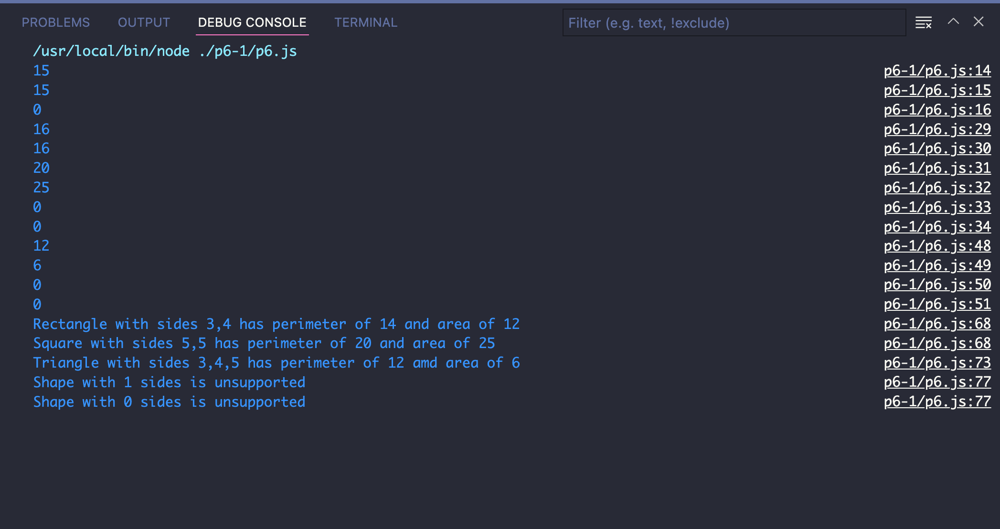

Project 6

For this project, we practice a lot about creating and working classes with inheritance.

As always, interpreting functional descriptions and specifications to complete an assignment is always a goal for this class and for CIT in general. 

We defined class with different shape, such as triangle and rectangle. We implement sides, and figuring out area. 

Here is an example outcome for configuring about class:

